# 🧠 AI Research Agent
### *Your Automated Science Partner*

<div align="center">

**A powerful, conversational AI agent that automates the entire research workflow—from finding relevant papers on arXiv to reading them and generating a brand-new, publication-ready research paper in PDF format.**

</div>

---

<div align="center">

[](https://huggingface.co/spaces/TanTheta03/research-agent)
[](https://langchain.com)
[](https://gemini.google.com)

[](https://streamlit.io)
[](https://docker.com)

</div>

---

## ✨ **Experience It Live**

> 🎯 **Ready to revolutionize your research?** The agent is deployed and running on Hugging Face Spaces!

<div align="center">

### **[👉 Try It Now - Live Demo](https://huggingface.co/spaces/TanTheta03/research-agent)**

</div>

---

## 🌟 **What Makes This Special**

<table>
<tr>
<td width="50%">

### 🎯 **Smart & Conversational**
Simply chat with the agent to define your research interests. No complex forms or configuration needed.

### 🔍 **Intelligent Discovery** 
Automatically scours arXiv for the latest and most relevant papers based on your topic using advanced search algorithms.

</td>
<td width="50%">

### 📄 **Deep Analysis**
Reads and processes the full text of any research paper from a URL, extracting key insights and methodologies.

### ✍️ **AI-Powered Synthesis**
Leverages Google's Gemini 2.5 Pro to synthesize information and write completely new, original research papers.

</td>
</tr>
<tr>
<td width="50%">

### ⚙️ **Professional Output**
Automatically compiles generated LaTeX source code into beautifully formatted PDFs, ready for academic submission.

</td>
<td width="50%">

### 🔬 **Multi-Domain Expertise**
Trained to assist across diverse fields including physics, computer science, mathematics, economics, and more.

</td>
</tr>
</table>

---

## 📸 **See It In Action**

<div align="center">

| 💬 **Chat Interface & Paper Discovery** | 🔄 **Paper Generation in Progress** |
|:---:|:---:|
|  |  |

| 📖 **Agent Finds and Reads Papers** | 📄 **PDF Ready for Download** |
|:---:|:---:|
|  |  |

</div>

---

## 🛠️ **Technology Stack**

<div align="center">

| **Category** | **Technologies** |
|:---:|:---|
| **🧠 Core Logic** |    |
| **🤖 AI Engine** |  |
| **🨠Frontend** |  |
| **☁️ Deployment** |   |
| **🔧 Tooling** |   |

</div>

---

## 🚀 **Quick Start Guide**

### **Prerequisites**

Make sure you have these installed on your system:

- 🐍 **Python 3.10+**
- 🔧 **Git**
- 📝 **[Tectonic LaTeX Engine](https://tectonic-typesetting.org)** - Required for PDF generation

### **Installation**

```bash
# 1️⃣ Clone the repository
git clone https://huggingface.co/spaces/TanTheta03/research-agent
cd research-agent

# 2️⃣ Create virtual environment
python -m venv venv
source venv/bin/activate  # Windows: venv\Scripts\activate

# 3️⃣ Install dependencies
pip install -r requirements.txt

# 4️⃣ Configure environment
echo "GOOGLE_API_KEY=your_api_key_here" > .env

# 5️⃣ Launch the application
streamlit run frontend.py
```

<div align="center">

🎉 **That's it!** Your research agent will be running at `http://localhost:8501`

</div>

---

## 💡 **How It Works**

```mermaid
graph TD
    A[🗣️ User Query] --> B[🔍 arXiv Search]
    B --> C[📋 Paper Selection]
    C --> D[📖 Content Analysis]
    D --> E[🧠 AI Synthesis]
    E --> F[📝 LaTeX Generation]
    F --> G[📄 PDF Compilation]
    G --> H[📥 Download Ready]

    style A fill:#3b82f6,stroke:#1d4ed8,color:#fff
    style H fill:#10b981,stroke:#047857,color:#fff
    style E fill:#8b5cf6,stroke:#7c3aed,color:#fff
```



---

## 🤝 **Contributing**

We love contributions! Here's how you can help make this project even better:

1. **🍴 Fork** the repository
2. **🌱 Create** a feature branch (`git checkout -b feature/amazing-feature`)
3. **💫 Commit** your changes (`git commit -m 'Add amazing feature'`)
4. **🚀 Push** to the branch (`git push origin feature/amazing-feature`)
5. **📩 Open** a Pull Request

---

## 📋 **Roadmap**

- [ ] 🔗 Integration with more academic databases (IEEE, PubMed, etc.)
- [ ] 📊 Advanced citation analysis and visualization
- [ ] 🎯 Collaborative research features
- [ ] 🌍 Multi-language paper support
- [ ] 📱 Mobile app development
- [ ] 🔄 Real-time collaboration features

---

## 📄 **License**

This project is open source and available under the [MIT License](LICENSE).

---

## 👨‍💻 **About the Creator**

<div align="center">

**Built with ❤️ by [TanTheta03](https://huggingface.co/TanTheta03)**

[](https://huggingface.co/TanTheta03)
[](#)

</div>

---

<div align="center">

### ⭐ **Show Your Support!** 

If you find this project helpful, please consider giving it a star! It means the world to open-source developers.

**[⭐ Star this Repository](https://github.com/your-username/research-agent)**

---

*"Transforming the way researchers discover, analyze, and create scientific knowledge."*

</div>

---

<details>
<summary>📚 <strong>Advanced Usage & Tips</strong></summary>

### **🎯 Getting Better Results**

- **Be Specific**: Instead of "machine learning," try "transformer attention mechanisms in NLP"
- **Use Keywords**: Include technical terms relevant to your field
- **Iterative Refinement**: Chat with the agent to refine your research scope

### **🔧 Troubleshooting**

- **PDF Generation Issues**: Ensure Tectonic is properly installed and accessible in your PATH
- **API Limits**: The Gemini API has rate limits; wait a moment if you hit them
- **Memory Issues**: For large papers, the agent processes content in chunks

### **🌟 Pro Tips**

- The agent works best with focused, specific research questions
- You can ask it to focus on particular aspects of papers (methodology, results, etc.)
- Generated papers include proper citations and references

</details>
